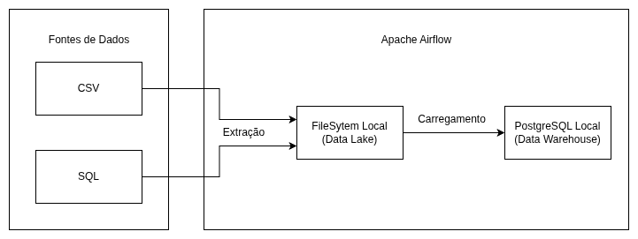

# **Indicium - Desafio de Engenharia de Dados**

## 🙋🏻‍♂️ Apresentação Pessoal
#### Olá, me chamo Lucas De Sousa Teixeira, tenho 21 anos e sou da cidade de Tapejara, no estado do Rio Grande do Sul. Atualmente, estou cursando Ciência da Computação na universidade do IFSUL - Campus Passo fundo.

---

## 📌 Objetivo do Projeto
O objetivo deste projeto é construir um pipeline de **extração**, **transformação** e **carga** (ETL) para centralizar dados do banco fictício **BanVic** em um Data Warehouse (DW) e orquestrar sua execução com o **Apache Airflow**.

Requisitos:

- Utilize o **Apache Airflow** (2 ou 3) como orquestrador de tarefas;

- As **extrações** devem ser **idempotentes**;

- Devem ser extraídos todos os dados fornecidos;

- As extrações devem escrever os dados no formato CSV para seu FIleSystem Local seguindo o padrão de nomenclatura:
    - ano-mês-dia / fonte-de-dados / nome-da-tabela-ou-csv . csv

- As etapas de **extração** de dados devem ocorrer **uma em paralelo à outra;**

- A etapa de carregamento no Data Warehouse deve ocorrer somente se ambas extrações tenham sucesso;

- O **pipeline** deve ser **executado** todos os dias **às 04:35 da manhã;**

- O projeto deve ser reproduzível em outros ambientes.

---

## 🏯 Arquitetura Utilizada
A solução foi construída usando o **Docker** para isolar os serviços e facilitar a execução do desafio:

- **db** --> Banco de origem (PostgreSQL) com dados iniciais carregados a partir de `banvic.sql`.
- **dw** --> Data Warehouse (PostgreSQL) criado a partir de `dw_ddl.sql`.
- **Airflow**: Orquestra execução diária dos scripts:
  - `extracao_postgres/extracao_completa.py`
  - `extracao_csv/extracao_transacoes.py`
  - `load_dw.py`

Fluxo da DAG (`banvic_pipeline`):




---

## 📂 Estrutura de Pastas

```
LH_ED_LUCASTEIXEIRA/
│
├── airflow/                     # Configs e DAGs (Airflow)
│ ├── dags/
│ │ └── banvic_pipeline.py
│
├── docs/                        # Scripts de criação de tabelas (SQL)
│ ├── banvic.sql
│ └── dw_ddl.sql
│
├── scripts/
│ ├── extracao_postgres/
│ │ └── extracao_completa.py
│ ├── extracao_csv/
│ │ └── extracao_transacoes.py
│ └── load_dw.py
│
├── docker-compose.yml           # Banco de origem e DW
├── docker-compose-airflow.yml   # Stack do Airflow
├── transacoes.csv               # Arquivo CSV de transações
│
└── YEAR-MONTH-DAY/              # Pastas geradas após execuções manuais
├── postgres/
│ ├── agencias.csv
│ ├── clientes.csv
│ └── ...
└── csv/
└── transacoes.csv

```

---

## ⚙️ Recursos Necessários
- **Docker** e **Docker Compose** instalados
- **Python 3**
- **Git** (para clonar o repositório)

---

## 🚀 Como Executar

### 1️⃣ Clone do repositório
```bash
git clone https://github.com/lucasteixeira03/LH_ED_LUCASTEIXEIRA.git
```

### 2️⃣ Subir bancos (origem e DW)
```bash
docker compose up -d
```
### 3️⃣ Subir Airflow
```
docker compose -f docker-compose-airflow.yml up -d
```

### 4️⃣ Inicializar Airflow (primeira vez)
```
docker compose -f docker-compose-airflow.yml run --rm airflow-init
```

### 5️⃣ Acessar Interface
- URL: http://localhost:8080
   - Usuário: airflow_lucas
   - Senha: wolfria123

### 6️⃣ Executar a DAG manualmente (banvic_pipeline)
- Clicar em **TRIGGER DAG**
- Aguardar todas as task ficarem verdes

### 7️⃣ Validar Resultado
- Conferir pasta gerada com a data do dia;
- Checar que arquivos **.CSV** foram gerados;
- Validar no DW com:
    - SELECT COUNT(*) FROM clientes;
    - SELECT COUNT(*) FROM transacoes;


---

### 📝Observações Finais
- Pastas de datas foram mantidas para comprovar histórico de execuções no repositório.
- Todos os scripts foram testados e orquestrados pelo Airflow.
- O **.gitignore** foi usado para impedir que volumes do Docker e logs sejam enviados ao repositório no github.


